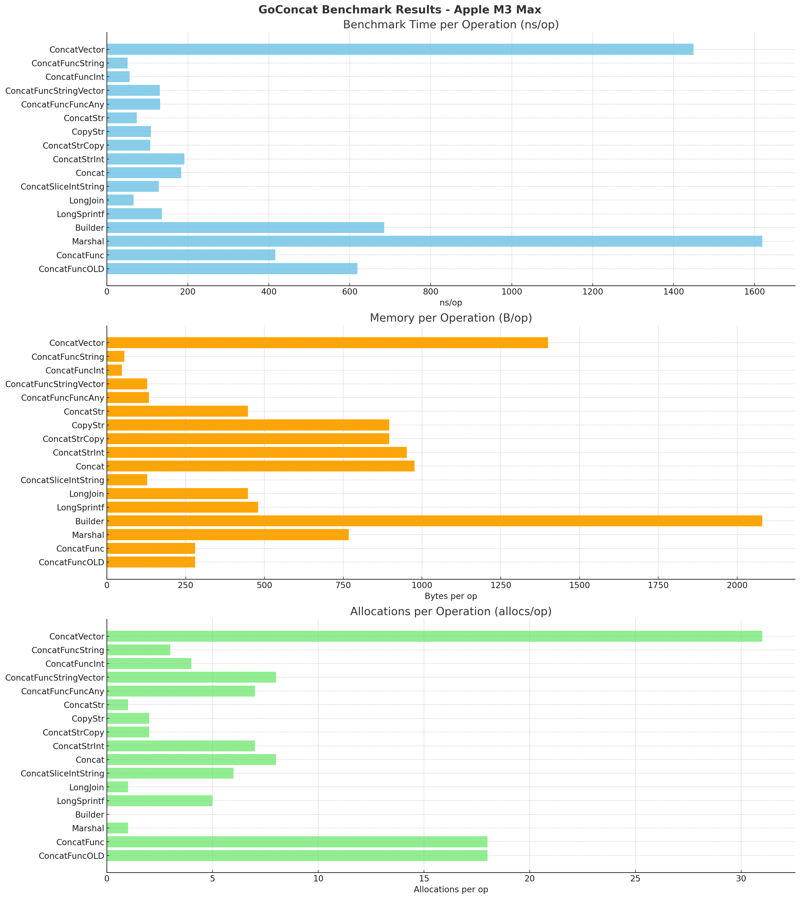

# 🧩 gconcat

### Flexible and Fast String Concatenation Library for Go

[](https://godoc.org/github.com/jeffotoni/gconcat) [](https://img.shields.io/github/v/release/jeffotoni/gconcat) [](https://dl.circleci.com/status-badge/redirect/gh/jeffotoni/gconcat/tree/master) [](https://goreportcard.com/badge/github.com/jeffotoni/gconcat) [](https://img.shields.io/github/license/jeffotoni/gconcat)  

>A simple lib for concatenation, it accepts several types as a parameter and returns a string. A battery of tests was done, there are some complexities that we cannot escape to have the best computational cost.

**gconcat** is a high-performance, **flexible string concatenation library written in Go**. Designed to simplify the handling of heterogeneous data types, it accepts interface{} inputs such as int, float, bool, string, []any, []int, []string, reflect.Value, structs, and more—automatically converting and joining them into efficient string outputs.

Internally optimized with **strings.Builder**, gconcat includes specialized functions like ConcatStr, ConcatStrInt, and ConcatFunc to handle common use cases such as combining slices, variadic inputs, and dynamic function returns. It gracefully handles nil, empty values, and reflection-based data, **while avoiding unnecessary allocations**.

**Benchmark tests conducted on Apple M3 Max (arm64) show gconcat outperforms many native and common Go idioms like fmt.Sprintf**, +, and Join, with nanosecond-level performance and minimal allocations.

**Ideal for high-throughput applications**, custom logging systems, serialization, or any scenario where rapid, readable, and type-agnostic string assembly is required.



## Example 

#### Concatenating some basic types in Go
```go
package main

import (
	g "github.com/jeffotoni/gconcat"
)

func main() {
	// accepting all types 
	str := g.Concat("/api/v1", "/", 39383838, "/", 129494, "/product/", 2012)
	println(str)

	// accepting only string
	str := g.ConcatStr("jeffotoni", "/", "2021", "/", "product")
	println(str)

	// accepting only string
	str := g.ConcatStrCopy("jeffotoni", "/", "2021", "/", "product")
	println(str)

	str := g.CopyStr("jeffotoni", "/", "2021", "/", "product")
	println(str)

	// accepting only string and int
	str := g.ConcatStrInt("jeffotoni", "/", 2021, "/", "product", "/", 1001)
	println(str)

	// accepting returns of params from functions
	str := g.ConcatFunc(foo())
	println(str)

	// combine types e functions returns
	str := g.Concat("jeffotoni",g.ConcatFunc(bar()),"/",2021)
	println(str)
}
```

#### Concatenating specific functions Go
```go
package main

import (
	g "github.com/jeffotoni/gconcat"
)

func main() {
	// accepting all types 
	str := g.Concat("/api/v1", "/", 39383838, "/", 129494, "/product/", 2012)
	println(str)

	// accepting only string
	str = g.ConcatStr("jeffotoni", "/", "2021", "/", "product")
	println(str)

	// accepting only string
	str = g.ConcatString("jeffotoni", "/", "2021", "/", "product")
	println(str)

	// accepting only string and int
	str = g.ConcatStrInt("jeffotoni", "/", 2021, "/", "product", "/", 1001)
	println(str)

	// accepting only string and int
	str = g.ConcatStringInt("jeffotoni", "/", 2021, "/", "product", "/", 1001)
	println(str)

	// accepting only int
	str = g.ConcatSliceInt([]int{3,4,678,33,77},[]int{9,6,4,6,7})
	println(str)

	str = g.ConcatSliceFloat32([]float32{3.1,4.0,67.89,33.88,77.666})
	println(str)

	str = g.ConcatSliceBool([]bool{true, false, true})
	println(str)
}
```

#### Concatenating types using interfaces
```go
package main

import (
	g "github.com/jeffotoni/gconcat"
)

func main() {
	var ii []interface{}
	ii = append(ii, "jeffotoni")
	ii = append(ii, " ")
	ii = append(ii, "joao")
	ii = append(ii, " ")
	ii = append(ii, 2021)

	var i interface{}
	i  = "jeffotoni"

	println(g.Concat(ii))
	println(g.Concat(i))
	println(g.Concat("jeffotoni", "&", "joao", " ", 20, "/08/"))
	println(g.Concat([]string{"2017", " ", "2018", " ", "2020"}))
	println(g.Concat([]int{12, 0, 11, 0, 10, 11, 12, 23, 3}))
	println(g.Concat(10,9,10,20,30,40,"x", "&", "."))
	println(g.Concat("R$ ",23456.33, " R$ ",123.33, " R$ ",19.11))
}
```

#### Concatenating Func in Go
```go
package main

import (
	g "github.com/jeffotoni/gconcat"
	"fmt"
)

func main() {
	f1 := func(a float64) float64 {
		return 1 * 2.2
	}(float64(55.55))

	f2 := func(s string) string {
		return s + "2021"
	}(" hello ")

	f3 := func(a int) int {
		return a * 2
	}(3)

	f4 := func(a []int) (t []int) {
		for _, v := range a {
			t = append(t, v*2)
		}
		return
	}([]int{4, 5, 6, 7, 8})

	f5 := func(a []int) (t []float64) {
		for _, v := range a {
			t = append(t, float64(v)*1.2)
		}
		return
	}([]int{4.0, 5.0, 6.0, 7.0, 8.0})

	s1 := g.Concat([]bool{true, false, true})
	s := g.ConcatFunc(f1, f2, f3, f4, f5)
	fmt.Println(s + " " + s1)
}
```

## Example on your project 
```go
package main

import (
	"log"
	"net/http"

	g "github.com/jeffotoni/gconcat"
)

const PORT = ":8282"

func main() {
	mux := http.NewServeMux()
	mux.HandleFunc("/ping",
		func(w http.ResponseWriter, r *http.Request) {
			str := g.Concat(
                            []int{1, 2, 3, 4, 5}, " ", 
                            []string{"Let's test our concat!!!"},
                    )
		w.Write([]byte(str))
		})
	    
	server := &http.Server{
		Addr:    PORT,
		Handler: mux,
	}
	println("Start Run: ", PORT)
	log.Fatal(server.ListenAndServe())
}

```

### Some types allowed
> - bool
> - int
> - int32
> - int64
> - interface
> - string
> - uint
> - float32
> - float64
> - []int
> - []int32
> - []int64
> - []interface
> - []string
> - []uint
> - []float32
> - []float64

## Install Using go mod in your project
```bash
$ go mod init <your-dir>
$ go mod tidy
$ go run main.go
``````

#### Another possibility would be
```bash
$ go get -u github.com/jeffotoni/gconcat
```

#### Test Benchmarking

```bash
go test -bench=. -benchtime=5s -benchmem
goarch: arm64
pkg: github.com/jeffotoni/gconcat
cpu: Apple M3 Max
BenchmarkConcatVector-16              	 4107244	      1449 ns/op	    1400 B/op	      31 allocs/op
BenchmarkConcatFuncString-16          	100000000	        51.20 ns/op	      56 B/op	       3 allocs/op
BenchmarkConcatFuncInt-16             	100000000	        56.18 ns/op	      48 B/op	       4 allocs/op
BenchmarkConcatFuncStringVector-16    	47412261	       130.8 ns/op	     128 B/op	       8 allocs/op
BenchmarkConcatFuncFuncAny-16         	45631294	       131.3 ns/op	     134 B/op	       7 allocs/op
BenchmarkConcatStr-16                 	82444666	        74.11 ns/op	     448 B/op	       1 allocs/op
BenchmarkCopyStr-16                   	54907971	       108.9 ns/op	     896 B/op	       2 allocs/op
BenchmarkConcatStrCopy-16             	51330475	       107.3 ns/op	     896 B/op	       2 allocs/op
BenchmarkConcatStrInt-16              	31643990	       191.7 ns/op	     952 B/op	       7 allocs/op
BenchmarkConcat-16                    	33193046	       184.0 ns/op	     976 B/op	       8 allocs/op
BenchmarkConcatSliceIntString-16      	46890064	       128.5 ns/op	     128 B/op	       6 allocs/op
BenchmarkLongJoin-16                  	90253273	        66.02 ns/op	     448 B/op	       1 allocs/op
BenchmarkLongSprintf-16               	43688498	       135.7 ns/op	     480 B/op	       5 allocs/op
BenchmarkBuilder-16                   	40134584	       684.9 ns/op	    2080 B/op	       0 allocs/op
BenchmarkMarshal-16                   	 3655041	      1619 ns/op	     768 B/op	       1 allocs/op
BenchmarkConcatFunc-16                	14150409	       415.8 ns/op	     280 B/op	      18 allocs/op
BenchmarkConcatFuncOLD-16             	 9384139	       618.9 ns/op	     280 B/op	      18 allocs/op
PASS
ok  	github.com/jeffotoni/gconcat	127.998s
```

#### Creators

Jefferson Otoni, [@jeffotoni](https://twitter.com/jeffotoni), [github.com/jeffotoni](https://github.com/jeffotoni), [linkedin.com/in/jeffotoni](https://www.linkedin.com/in/jeffotoni)   

João Vitor – [@ancogamer](https://twitter.com/ancogamer), [github.com/ancogamer](https://github.com/ancogamer), [linkedin.com/in/joão-vitor-astori-saletti](https://www.linkedin.com/in/joão-vitor-astori-saletti)


Distributed under the MIT license. See ``LICENSE`` for more information.

## Contributing

To contribuit is simples, just clone or fork the repository and send to us the pull request
